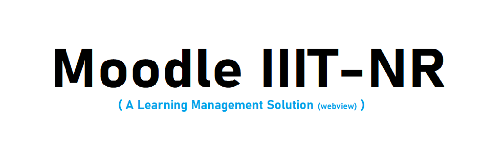

<a href="Screenshots/Moodle IIITNR.apk" target="_blank"><a>
<a href="LICENSE"><a>
 
<marquee width="60%"height="100px" behavior="alternate" onmouseover="this.stop();" onmouseout="this.start();">
</marquee>

## Description #

This project is an Android application developed using Android Studio that can be used by the student to perform various activities realted to academics.Moodle IIITNR Learning solution is platform provided by IIITNR IT-department for daily Assignment evaluation ,Project submission and to get notify about upcoming Academic Activities to its student.This app is webView  of this platform with some extra added feature for hassle free use.

## Features
* Simple and minimal Layout Designs.
* Interlinked Activities for different functions.
* Text Views and Toasts for displaying info.
* Interaction with the User with the help of Edit Text Views, Buttons, Checkboxes, Alert Dialogs, Card Views, etc.
* Updates using Push Notifications.
* Real-time Synchronization with Online Database.
* Login on App launch if the student is not logged IN.

## Functionalities
* Student Account :

  * Student can see upcoming Assignment.
  * notification for upcoming unsubmitted assignment.
  * Upload assignment drawer.
  * Activity for upcoming academic activity
  * Assignment submission and verification Window
  

## Screenshots

||||
|:--:|:--:|:--:|
|**Login Window**|**Dashboard**|**View**|

|||
|:--:|:--:|
|**Fle Upload**|**File Selector**|

## Tools Used
* [Android Studio](https://developer.android.com/studio) : Used as the Android developement environment.
* [jsoup](https://jsoup.org/) : For webScrapping

## Contributing
You are welcome to contribute :

1. [Fork it](https://github.com/saurabhpandey9/Moodle-IIIT-Naya-Raipur/fork) :`https://github.com/saurabhpandey9/Moodle-IIIT-Naya-Raipur/fork`
2. Create new branch : `git checkout -b new_feature`
3. Commit your changes : `git commit -am 'Added new_feature'`
4. Push to the branch : `git push origin new_feature`
5. Submit a pull request !

## License
This Project is licensed under the MIT License, see the [LICENSE](LICENSE) file for details.

## Author 
**Thanks for going through this Repository! Have a nice day.** 
 **Saurabh Pandey**  
#### Contact :`saurabh17100@gmail.com`

